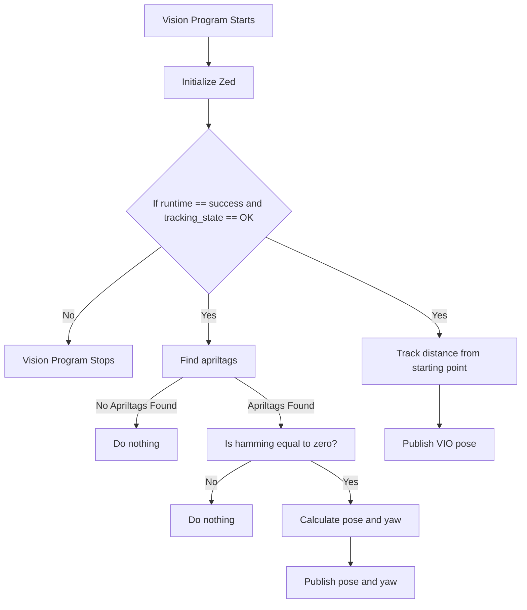

# 2023Vision
This repository contains python scripts that use duckie-town apriltags and the zed sdk and run on a Jetson Xavier

https://github.com/duckietown/lib-dt-apriltags
https://www.stereolabs.com/docs/

## Vision Processign Algorithm


## Math
picture of explanation for how the math works

## Prerequisites
In order to use these scripts, the Zed SDK, duckietown apriltags, numpy, opencv, and RobotPy NetworkTables must be installed on the device or computer that will be using them.

They can be installed by running the commands:

install numpy
```
pip install numpy
```

install opencv
```
pip install opencv-python
```

install Networktables
```
pip install pynetworktables
```
## Setup
In order to get the repo on the xavier, connect a computer to the xavier using the default IP address for the USB device 
server.
```
ssh user@192.168.xx.x
```
Then the files can be moved between the two systems using Secure Copy Protocol
```
scp -r .\Path_To_Code\ user@192.168.xx.x:~
```
The tilda can be replaced by the directory in which the user would like the repository to be copied to


