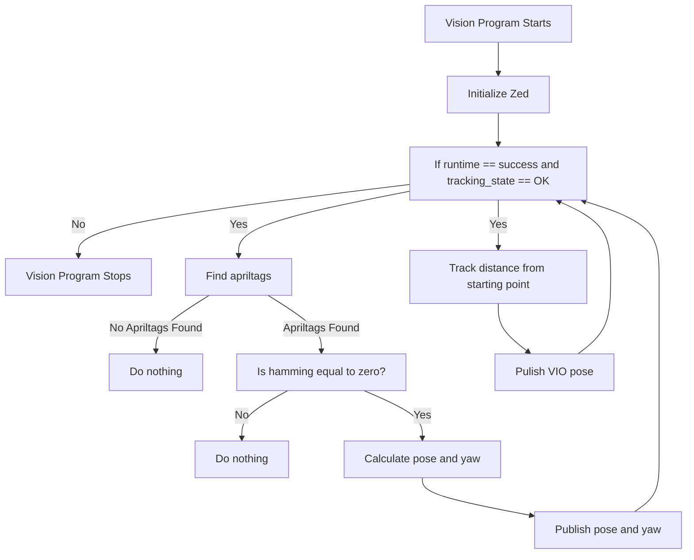

# 2023Vision
This repository contains python scripts that use duckie-town apriltags and the zed sdk and run on a Jetson Xavier

https://github.com/duckietown/lib-dt-apriltags

https://www.stereolabs.com/docs/

## Vision Processign Algorithm

## Math
The scripts in this program use extremely basic linear algebra.

Equation for finding robot pose:
T<sub>F,R</sub> = T<sub>F,A</sub> * T<sub>Z,A</sub><sup>-1</sup> * T<sub>Z,ZP</sub> * T<sub>ZP,R</sub>

The T in each matrix simply means transformation.

T<sub>F,R</sub> = Tranformation matrix of field to robot also know as pose

T<sub>F,A</sub> = Transformation matrix of field to apriltag also know as the location of an apriltag

T<sub>Z,A </sub><sup>-1</sup> = the inverse of the matrix of zed to apriltag

T<sub>Z,ZP</sub> = The zed on the robot will be mounted at a negative 20 degree angle. This translation matrix will acount for that

T<sub>ZP,R</sub> = Transformation matrix of the zed position of the robot to the center of the robot. This is so that the everything calculated will be relative to the center of the robot.

Further math explanation:
1. T<sub>Z,A</sub><sup>-1</sup> = T<sub>A,Z</sub>

   T<sub>F,A</sub> * T<sub>A,Z</sub> = T<sub>F,Z</sub>

   The As cancel out a lot like train track multiplication. When multiplied together, these matrices now represent a transformation matrix of field to zed.

2. T<sub>F,Z</sub> * T<sub>Z,ZP</sub> = T<sub>F,ZP</sub>

   The Zs cancel out so now the new transfomration matrix represents field to zed prime

   the word prime is added to something to show that something has been translated or rotated.

3. T<sub>F,ZP</sub> * T<sub>ZP,R</sub> = T<sub>F,R</sub>

   the ZPs cancel out to get the pose.

## Prerequisites
In order to use these scripts, the Zed SDK, duckietown apriltags, numpy, opencv, and RobotPy NetworkTables must be installed on the device or computer that will be using them.

They can be installed by running the commands:

install numpy
```
pip install numpy
```

install opencv
```
pip install opencv-python
```

install Networktables
```
pip install pynetworktables
```

Instead of installing everything manually, the setup script could be run to install all dependencies. This script is found in the scripts folder.

make the script executable
```
chmod +x setup.sh
```

run the script
```
./setup.sh
```
## Setup
In order to get the repo on the xavier, connect a computer to the xavier using the default IP address for the USB device 
server.
```
ssh user@192.168.xxx.xxx
```
Then the files can be moved between the two systems using Secure Copy Protocol
```
scp -r .\Path_To_Code\ user@192.168.xxx.xxx:~
```
The tilda can be replaced by the directory in which the user would like the repository to be copied to

Ex:
```
scp -r .\Path_To_Code\ user@192.168.xxx.xxx:~/filepath/
```


